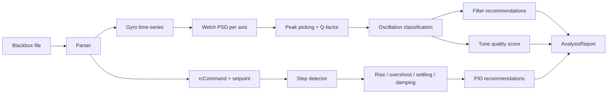

# drone-tuner

A Rust CLI that reads a Betaflight blackbox log, analyses it for PID/filter
problems, and writes safer values back to the flight controller over MSP.

It's been validated end-to-end on two real quads (Jeno STM32H743, TBS
Source One STM32F7x2): pull a log → analyse → apply recommended PIDs
→ persist to EEPROM. Both quads survived multiple tune iterations and
power cycles.

## Status

| Capability | State |
|---|---|
| Blackbox parser (Betaflight BBL) | Working |
| FFT + oscillation detection | Working |
| PID and filter recommendations | Working, calibrated against real flights |
| Step-response analysis | Working |
| MSP read/write (PID, filter config, EEPROM) | Working on hardware (Jeno H743, TBS Source One F7) |
| Filter writeback via `MSP_FILTER_CONFIG` blob round-trip (cmd 92 + 93) | Validated against Betaflight 4.5.x source; simulator round-trip tests |
| Onboard dataflash pull (`--pull-bbl`) | Validated on TBS Source One; ~50 KiB/s @ 115200 baud, V2 1 KB chunks |
| Post-success dataflash erase (`--erase-after-pull`) | Erase only fires after pull + parse + apply all succeed |
| Robust session selection across partially corrupt BBLs | Implemented (positional → raw idx mapping) |
| Desktop GUI (Tauri) | Not started |
| ML pattern recognition | Not started |
| Tune marketplace | Not started |

`docs/PROJECT_ASSESSMENT.md` keeps the prioritised roadmap.

## How it works, step by step

The interesting command is `tune`. Here's what it does, in order, when
you run it against a real FC.

### 1. Resolve the blackbox file

Two sources are supported:

- **Local file**: `drone-tuner tune path/to/flight.bbl`
- **Pull from FC**: `drone-tuner tune --pull-bbl` — auto-discovers the
  FC's serial port (or pass `--connection /dev/ttyACM0` to override).

With `--pull-bbl`, the tool issues `MSP_DATAFLASH_SUMMARY` (cmd 70) to
get the chip's used/total bytes, then loops `MSP_DATAFLASH_READ` (cmd 71)
until the whole blob is in memory. A live progress bar shows
bytes/sec and ETA.

The default chunk size is **1024 bytes over MSPv2 framing** — proven
across our test fleet without overrunning the FC's USB CDC TX buffer.
`--pull-chunk-size 2048` (or up to 32768) experiments with larger
chunks; `256` falls back to the V1-cap behaviour. On firmware that
only speaks V1, the pull silently degrades to ~240-byte chunks.

The pulled bytes are written to `/tmp/drone-tuner-pull-<craft>-<ts>.bbl`
by default — the craft slug comes from `MSP_NAME` (cmd 10), so
multi-quad logs don't collide. `--keep-bbl <PATH>` overrides the
destination (file path is used verbatim; an existing directory gets a
generated filename inside it).

`--erase-after-pull` queues `MSP_DATAFLASH_ERASE` (cmd 72) **only after
the entire tune flow succeeds** (pull + parse + analyse + apply). If
anything downstream fails, the chip is left intact so you can re-pull.

### 2. Parse

`SimpleBlackboxParser` walks the BBL header, picks the requested session
(default: most recent; override with `--session N` or
`--session-strategy {first,last,longest}`), and decodes the I/P frame
stream into a `FlightSession`.

**Robust session selection.** A real BBL pulled from a chip that
crashed mid-flush typically has a mix of clean and unparseable
sessions. The detector enumerates *all* raw sessions, keeps the ones
whose headers parse, and the strategy chooses among those. The chosen
positional index is then translated back to its raw `file.iter()` idx
before reading frames — earlier versions conflated those two index
spaces and would happily try to parse session #4 when session #4 was
exactly the corrupted one.

**Sample-rate detection** has three fallbacks, in order:

1. Frame-interval headers (`I_interval`, `P_interval`, `pid_process_denom`)
   — the cheap and accurate path.
2. `pid_rate` header directly.
3. Frame timestamps: `frame_count / (max_time_raw - min_time_raw)`.
   This rescues logs whose interval headers are truncated, which is
   common on crashed-mid-flush dumps.

If all three fail, a final `WARN` flags that frequency analysis may be
inaccurate. A clean log produces no warnings.

### 3. Analyse

`AnalysisEngine::analyze` runs two independent tracks; their outputs
combine into a single `AnalysisReport`:

- **FFT track** answers *"is the quad resonating at any specific
  frequency?"* → produces filter recommendations + the tune quality
  score.
- **Step-response track** answers *"how does the closed loop respond
  to pilot input?"* → produces PID recommendations.

Each peak/recommendation is tagged with a priority
(`Critical`/`High`/`Medium`/`Low`) and a plain-language reason. See
[How the algorithm works](#how-the-algorithm-works) below for the math.

### 4. Display recommendations + findings

The report is printed regardless of whether you intend to apply
anything. Each rec has an icon, a "current → recommended" line, and a
reason:

```
PID Adjustments:
    [H] Yaw P: 76.0 → 53.2
      Reason: Reduce P-term to decrease overshoot from 32.5% to target 15.0%

Filter Adjustments:
    [M] Dynamic Notch: 1 notches, 16-500 Hz (Q: 10)
      Expected 15.0% reduction in frame resonance by expanding dynamic notch range
```

Priority tags: `[C]` Critical, `[H]` High, `[M]` Medium, `[L]` Low.

**Even when no recs fire**, the analyser's findings are surfaced — so
"no changes needed" reads as *measured silence* rather than ambiguous
emptiness:

```
Tuning Recommendations:

  ok  Tune quality: 100.0/100 — no changes needed

  Step responses analyzed: 12 (5 roll, 5 pitch, 2 yaw)
  Gyro spectrum (noise floor 0.0001):
    Roll : no peaks above threshold
    Pitch: no peaks above threshold
    Yaw  : no peaks above threshold
    measured silence — no oscillation peaks above noise floor
  Active filters at log time:
    Gyro LPF:    250 Hz (LowPass, order 2)
    D-term LPF:  100 Hz (LowPass, order 2)
    Dyn Notch:   150-600 Hz (Q=120)
```

Top-3 gyro peaks per axis, the noise floor, and the filter cutoffs
that were active during the analysed log all show up here even when
recs are non-empty — they're context for the recommendations above.

### 5. Apply (only with explicit opt-in)

The default is **read-only**. To actually write to the FC you have to
pass one of:

- `--auto-apply-safe` — only applies `Low`/`Medium` priority recs.
- `--apply-all` — applies every rec (including `Critical`/`High`).

The apply phase:

1. Opens the FC connection (USB serial via `serialport`, or the
   in-process `simulator://` scheme for dry runs).
2. Reads the current full PID payload via `MSP_PID` (cmd 112) — all 30
   bytes. We round-trip the entire payload so axes the tool doesn't
   touch (LEVEL/MAG/NAV/etc.) come back unchanged.
3. Computes the new payload by mutating only the recommended (axis,
   term) tuples.
4. Calls `apply_pid_with_rollback`, which is **read → write → on
   write-or-ack failure, restore the backup**. The pre-change snapshot
   is also returned to the caller for forensics.
5. With `--backup <PATH>`, dumps that pre-change snapshot to JSON.
6. With `--save-eeprom`, sends `MSP_EEPROM_WRITE` (cmd 250) so the
   change survives a power cycle. Without it, RAM-only changes will
   revert on next reboot — itself a useful safety net.
7. Appends one row to `~/.local/share/drone-tuner/history.jsonl` (or
   `$XDG_DATA_HOME/drone-tuner/history.jsonl`) recording the FC
   identity, the BBL fingerprint, the before/after PIDs, and whether
   the change was persisted.

Each step gets a section banner and a result line on stdout, so you can
see exactly where you are even when run under CI or with output piped
to a file:

```
== Apply ==
  ok  connected: BTFL 4.5.1 (api 1.46.0, target STM32H743)
  ok  current: roll=(42, 85, 35) pitch=(46, 90, 38) yaw=(45, 90, 0)
  1 PID change(s) staged:
    Yaw   P/I/D: (45, 90, 0) → (53, 90, 0)
  ok  PIDs written; backup retained in memory
  backup written to tune-backup-20260426-130045.json
  ok  changes persisted across power cycles
Tune logged to ~/.local/share/drone-tuner/history.jsonl
  ok  Tune complete.
```

### 6. Filter writeback (binary blob round-trip)

After PIDs are written, filter recommendations are applied via
**`MSP_FILTER_CONFIG`** (cmd 92, read) → mutate → **`MSP_SET_FILTER_CONFIG`**
(cmd 93, write). The FC's authoritative filter blob is fetched first,
the CLI mutates only the bytes the recommendations target, then writes
the whole mutated blob back. `apply_filter_with_rollback` restores the
pre-write snapshot if the FC nacks the write.

Why not parameter-by-name? Earlier versions tried `MSP2_COMMON_SET_SETTING`
(cmd 0x1004) and failed every time on real hardware. **That command is
not implemented in Betaflight 4.5.x** — verified at
`/home/flo/workspace/github/betaflight` tag `4.5.1`: grepping
`src/main/msp/` for `0x1003` / `0x1004` / `MSP2_COMMON_*_SETTING`
returns zero hits. Configurator's CLI works because the CLI is a
separate REPL on the FC, not an MSP path. The binary blob via cmd 92/93
is the path Configurator uses for the Filters tab and is what the
firmware actually accepts.

Fields the CLI knows how to mutate (Betaflight 4.5 layout, 49-byte
payload):

- `gyro_lpf{1,2}_static_hz`, `gyro_lpf{1,2}_type`, `gyro_lpf1_dyn_{min,max}_hz`
- `dterm_lpf{1,2}_static_hz`, `dterm_lpf{1,2}_type`,
  `dterm_lpf1_dyn_{min,max}_hz`, `dterm_lpf1_dyn_expo`
- `yaw_lowpass_hz`
- `dyn_notch_count`, `dyn_notch_q`, `dyn_notch_min_hz`, `dyn_notch_max_hz`
- `rpm_filter_harmonics`, `rpm_filter_min_hz` (u8 in 4.5)

Bytes the CLI does *not* touch (deprecated padding, fields whose
encoding shifts between firmware versions, static notch slots) round-
trip verbatim from read → write. That's how the binary path stays
version-safe for fields outside the known-stable set.

Stripped or older firmware: every setter is gated on payload length.
A FC returning, say, 32 bytes of filter config (no dyn-notch / RPM
filter section) gets the prefix mutations applied and the unsupported
fields surfaced as a "FC's filter config payload too short" note. No
brick risk. Pass `--skip-filters` to disable filter writeback entirely.

### 7. Cleanup (only on full success, only if requested)

When `--erase-after-pull` is set and the entire flow above completed
without error, the tool reconnects briefly and queues
`MSP_DATAFLASH_ERASE` (cmd 72). The chip acks immediately and finishes
the wipe in the background. Skipped on `--dry-run`; skipped silently
if the apply step never ran (e.g. analysis-only mode). The point is
that a parse failure, an apply rollback, or any other downstream error
will *not* destroy the BBL on the chip.

## Connection schemes

The `--connection` argument supports several forms:

- `auto` — scan USB serial ports and pick the FC automatically. Prefers
  STM32 VCP (vid `0x0483`, what every Betaflight board enumerates as);
  falls back to any USB serial. Errors with the candidate list if more
  than one device is plugged in.
- *(omit `--connection` entirely)* — when `--pull-bbl` /
  `--apply-all` / `--auto-apply-safe` is set, the same auto-discovery
  as `auto` runs implicitly. `--pull-bbl` hard-fails if no FC is found
  (it has no fallback); apply flags soft-fail to analysis-only mode so
  existing workflows aren't broken.
- `/dev/ttyACM0`, `/dev/ttyUSB0`, `COM3` — bare device path → USB serial.
- `serial:///dev/ttyACM0` — same thing, explicit scheme.
- `simulator://` — in-process MSP simulator. Handshake works, PID
  read/write round-trip, but dataflash is empty.
- `simulator://path/to/file.bbl` — in-process simulator with its
  dataflash preloaded from a real BBL. Lets you exercise the full
  `--pull-bbl` chain without serial hardware.

## Commands

```bash
drone-tuner info                                  # version + capability check
drone-tuner analyze logs/flight.bbl                # parse + analyse, print report
drone-tuner analyze logs/                          # batch over a directory
drone-tuner analyze logs/flight.bbl --list-sessions
drone-tuner analyze logs/flight.bbl --detailed --show-details

drone-tuner compare flight1.bbl flight2.bbl flight3.bbl

drone-tuner validate logs/ --check-issues

drone-tuner monitor /dev/ttyACM0 --rate 100 --duration 30

drone-tuner tune path/to/flight.bbl                  # analyse only, no writes
drone-tuner tune --pull-bbl                          # auto-discover FC, pull, analyse
drone-tuner tune --pull-bbl --apply-all --save-eeprom  # full one-shot tune, auto-discovered
drone-tuner tune --pull-bbl --keep-bbl ~/logs/flight.bbl
drone-tuner tune path/to/flight.bbl --connection auto --dry-run  # explicit opt-in
drone-tuner tune path/flight.bbl --auto-apply-safe --save-eeprom --backup ./pre-tune.json
drone-tuner tune path/flight.bbl --connection /dev/ttyACM0 --apply-all --save-eeprom

drone-tuner export flight.bbl --output dump.json --format json --include-fft
```

Global flags: `--verbose`, `--detailed-info`, `--output-format
{pretty,json,csv}`.

## Safety design

The tool can change parameters that affect flight safety. The defaults
are deliberately paranoid:

- **No writes without an explicit flag.** `tune` reads but does not
  apply unless `--auto-apply-safe` or `--apply-all` is set.
- **Atomic writeback with rollback.** Every PID write goes
  read → write → on-failure-restore-backup. The backup snapshot is also
  returned to the caller so it can be persisted to disk.
- **EEPROM persistence is opt-in.** Without `--save-eeprom`, changes are
  RAM-only and revert on the next power cycle.
- **Filter writeback is length-gated and rollback-safe.** Each setter
  refuses to touch a field beyond the FC's actual payload length, and
  `apply_filter_with_rollback` restores the pre-write blob on a nack
  (see step 6). `--skip-filters` disables it entirely.

The history JSONL log gives you a paper trail per FC across every tune
iteration, keyed on `board_id` + `target_name`.

## How the algorithm works

Two independent tracks feed the report. The FFT track scores
oscillation severity and proposes filter changes; the step-response
track grades closed-loop dynamics and proposes PID changes.



### FFT track

**Welch's PSD** (`analysis.rs`):

- 2048-sample windows, 50 % overlap, **Hann** windowing
- Per window: `rustfft` forward FFT → `|X[k]|²` → accumulate → average
- Bin resolution = `sample_rate / 2048` (≈2 Hz at 4 kHz logging)
- Output: single-sided PSD over `0..N/2`

Caveat: the current PSD lacks `Σw²` window-energy correction, so its
magnitudes aren't strictly V²/Hz. Thresholds are calibrated against
real flights rather than absolute units.

**Peak detection:**

- 3-point local maxima within 10–1000 Hz, amplitude > `0.1`
- **Q-factor** = `f_peak / Δf_3dB`, where Δf is the bandwidth at
  half-power (walk left/right from the peak)
- **Noise floor** = **median** of the PSD vector — robust against the
  peaks themselves

**Filter optimiser** (`filters.rs`):

- Peak with `Q > 10` → biquad notch at `f_peak`,
  `Q_filter = max(Q_peak / 2, 5)` — a slightly broader notch than the
  resonance, to absorb thermal/load drift
- Existing gyro LPF cutoff *above* the highest problematic peak →
  drop cutoff to `max(f_peak × 0.8, 50 Hz)`
- Notch design uses RBJ biquad form; LPF uses bilinear-transformed
  Butterworth (2-pole branch fully implemented)

### Step-response track

**Step detection** (`analysis/pid.rs`) — windowed, not single-sample
delta:

- 50 ms pre-window, 100 ms post-window, 300 ms refractory
- Trigger when `|mean_post − mean_pre| > 0.10` AND
  `pre_jitter < 0.05` AND `post_jitter < 0.10` (clean step, not noise)
- RC normalised by 99th-percentile abs value (handles raw
  Betaflight `[-500, 500]` and pre-normalised inputs uniformly)

**Per step, measured:**

| Metric | Definition |
|---|---|
| Rise time | 10 % → 90 % of expected gyro response |
| Overshoot % | `(peak − baseline − expected) / |expected| × 100` |
| Settling time | scan backwards; first sample outside ±2 % of expected |
| Damping ratio | `exp(−π·OS / √(1 + π²·OS²))` (classical 2nd-order) |
| Oscillation freq | zero-crossing rate of (gyro − mean) |
| Steady-state error | tail (last 50 ms) on big clean steps only (`|Δstick| ≥ 0.30`, drift ≤ 0.10) |

**PID recommendation rules:**

- **P↓** if `avg_overshoot > 15 %` → reduce `(OS − 15) / 50`, capped 30 %
- **P↑** if `rise_time > 150 ms AND overshoot < 5 %` → +10 %
- **I↑** if ≥3 valid SS responses AND `avg_ss_error > 30 deg/s` → +10 %
  (deliberately conservative; +20 % previously caused runaway recs)
- **D↑** if `osc_freq > 10 Hz AND damping < 0.5` → +30 %
- **D↓** if `settling > 500 ms AND osc_freq < 5 Hz` → -20 %
- Hard caps: `P ≤ 80, I ≤ 180, D ≤ 60`

When no `rcCommand` is available, a gyro-only fallback proposes
amplitude-based attenuations (D × 0.8, P × 0.9) on the same
oscillation cues.

### Tune quality score

Starts at **100.0**, subtracts:

- P-term oscillation: `amplitude × 5`
- D-term oscillation: `amplitude × 3`
- Mechanical resonance: `amplitude × 10` (heaviest penalty)
- Motor noise: `amplitude × 2`
- Plus: if `avg_noise_floor > 1.0`, subtract `(avg_noise − 1.0) × 20`

Clamped to `[0, 100]`. So **100 / 100 = no detected oscillations *and*
noise floor ≤ 1.0** in PSD units. Step-response metrics are not
currently part of the score (they only feed PID recs).

### Known sharp edges

- `expected_response = Δstick × 500` is hardcoded and ignores the
  configured rates / super-rate. Small `Δstick` values can produce
  apparent overshoots near -100 %. Tracked.
- PSD lacks window-energy correction, so magnitude thresholds aren't
  fully portable across logging rates.
- Bilinear transform fully covers only the 2-pole branch; higher
  orders silently degrade.

These are flagged in `docs/PROJECT_ASSESSMENT.md` as roadmap items
rather than active correctness bugs — the calibration-fixture suite
catches regressions on real flights.

## Project layout

| Path | Purpose |
|---|---|
| `crates/drone-tuner-core/src/analysis.rs` | FFT + oscillation detection + filter optimiser |
| `crates/drone-tuner-core/src/analysis/pid.rs` | Step-response analysis + PID recommendations |
| `crates/drone-tuner-core/src/blackbox/` | Custom Betaflight BBL parser |
| `crates/drone-tuner-core/src/domain.rs` | `FlightSession`, `AnalysisReport`, recommendation types |
| `crates/drone-tuner-core/src/filters.rs` | Butterworth / notch / biquad design |
| `crates/drone-tuner-core/src/realtime.rs` | MSP framing, `FlightControllerConnection`, simulator |
| `crates/drone-tuner-core/src/error.rs` | Error types |
| `crates/drone-tuner-cli/src/main.rs` | CLI entrypoint, all subcommands |
| `crates/drone-tuner-cli/src/history.rs` | `~/.local/share/drone-tuner/history.jsonl` writer |
| `crates/drone-tuner-cli/tests/` | Integration + command-specific suites |
| `test_data/` | Real `.bbl` fixtures used by calibration tests |
| `docs/` | PRD, technical doc, project assessment |

There are **no Cargo feature flags**. `tune`, `monitor`, MSP serial,
and the in-process `simulator://` simulator are all default-on.

## Library usage

```rust
use drone_tuner_core::{AnalysisEngine, BlackboxParser};

let bytes = std::fs::read("flight.bbl")?;
let mut parser = BlackboxParser::new();
let session = parser.parse_file(&bytes)?;

let mut engine = AnalysisEngine::new();
let report = engine.analyze(&session)?;

println!("Quality score: {:.1}", report.tune_quality_score);
for rec in &report.pid_recommendations {
    println!("{:?} {:?}: {:.1} → {:.1}",
             rec.axis, rec.term, rec.current_value, rec.recommended_value);
}
```

Realtime usage:

```rust
use drone_tuner_core::realtime::FlightControllerConnection;

let mut fc = FlightControllerConnection::connect("/dev/ttyACM0").await?;
let pids = fc.read_pid().await?;
let summary = fc.read_dataflash_summary().await?;
let blob = fc.pull_dataflash(|done, total| {
    eprintln!("{done}/{total}");
}).await?;
```

## Building and testing

```bash
cargo build --release                # release binary at target/release/drone-tuner

cargo test -p drone-tuner-core       # 101 unit tests
cargo test -p drone-tuner-core --test calibration   # real-flight regression fixtures
cargo test -p drone-tuner-cli                       # ~140 CLI tests across 4 suites

cargo clippy
cargo fmt
```

## Acknowledgments

- RustFFT for the FFT backbone
- Betaflight for the blackbox format and MSP protocol
- The FPV community

## License

Dual-licensed under either of:

- [MIT](LICENSE-MIT)
- [Apache License, Version 2.0](LICENSE-APACHE)

at your option. Unless you explicitly state otherwise, any contribution
intentionally submitted for inclusion in the work by you, as defined in
the Apache-2.0 license, shall be dual-licensed as above without any
additional terms or conditions.

## Disclaimer

This tool writes parameters that affect flight safety. Even with the
read-before-write rollback safety net, every recommendation it produces
is the output of a heuristic operating on noisy data. **Always inspect
proposed changes, fly cautiously after a tune, and keep a Configurator
backup of your known-good config.** No warranty.
